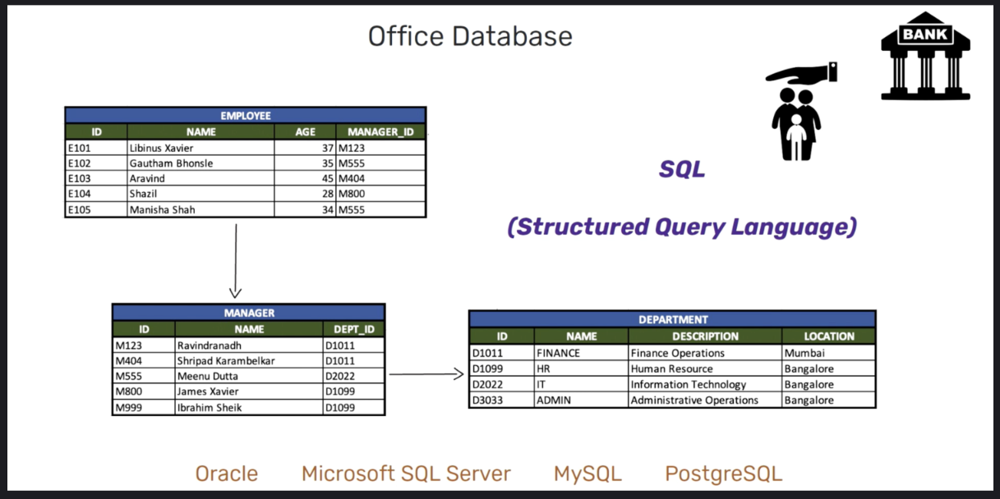

# Database Introduction

## Table of Content
- What is data?
- What is database?
- What is DBMS (Database Management System)?
- Type of databases
- How to use DBMS
- Hands-on!

### Ref:
- https://techtfq.com/blog/learn-what-is-database-types-of-database-dbms-omQVL
- https://forum.huawei.com/enterprise/en/data-vs-information/thread/747529-891


## What is data?
Data can be anything and everything. Any information or fact can be considered as data.
Your name, age, data of birth or any other information such as your house address, bank balance, vehicle you drive or even the food you eat can be considered as data even a plain text.

Data can be importrant, because data equals knowledge. It can help find solutions to problems, make informed decisions and much more

**DIKW** (Data Information Knowledge Wisdom) is the model used for discussion of data, information, knowledge, wisdom and their interrelationships. It represents structural or functional relationships between data, information, knowledge, and wisdom.


## What is database?
Database can be considered as a container filled with data or information which is electronically stored in a computer system.

Data in any form can be stored into the database.
Purpose of storing data in a database is so that it can be easily accessed, modified, protected and analyzed.

You may already be using database everyday without your knowledge because most of the websites or mobile apps that you use everyday such as Google, Instagram, WhatsApp, Facebook etc already use database to store their data.

To put it simple, database is a collection of organised data that can be efficiently stored, sorted, and searched.


## What is DBMS (Database Management System)?


Lot of people refer to database as DBMS but that’s not entirely correct because database is just a container which stores data whereas Database Management System or DBMS is a software which is used to manage your database.

You need DBMS to interact with database, to store, modify, retrieve and protect data. DBMS is also required to create, modify and delete databases.


Users like you and me can use DBMS to enter commands in specific language to interact with Database. 
Example of a DBMS is SQLite, MySQL, PostgreSQL, MongoDB, Neo4j, Cassandra etc.


## Type of databases
You can read in [here](https://techtfq.com/blog/learn-what-is-database-types-of-database-dbms-omQVL) to know about history of database. However in today’s world, there are mainly 2 popular database types. 
- Relational Database
- Non-Relational Database (or NoSQL Database)

### Relational Database
In a relational database, data is stored through collection of tables. These tables are related to one another. 

Each table consist of columns and rows. Each column has a name and a data type. Data type can be said as a data rule which is associated to every column. Only those data that satisfy these data rule can be inserted in the specific column. 
A row can be treated as a record which is formed by single or multiple columns.

In a relational database, using DBMS, you can enter commands in specific language to store, retrieve and modify data. 
This specific language is SQL (Structured Query Language)

SQL is a programming language which follows a standard format for querying data across different relations database.


As an example, if we consider an office database, it may have information related to Employees, Managers and Departments. These details are stored in different tables. But these tables will be related to each other through certain columns.

Here Employee and Manager table is related through the Manager_ID column which is present in both these tables. In a relational database, the foreign key constraint is used to form relations between different tables.

Similarly Manager and Department table are related through dept id column.

As you can see, employee and department table are not directly related to each other. But still it is possible to fetch data from employee table based on specific conditions from department table.
<hr>
In a relational database, using DBMS, you can enter commands in specific language to store, retrieve and modify data. 
This specific language is SQL (Structured Query Language)

SQL is a programming language which follows a standard format for querying data across different relations database.

## Non Relational Database:
When it comes to a non relation database there are several categories of database. Such as:
- Key Value Store / Key Value Database
- Document Database
- Graph Database
- Wide Column Database
- Search Engine Database
- Time Series Database 

Each of these database types store data differently and are useful for managing specific types of data. 

## What is SQL (Structured Query Language)?
SQL is used a language that can be used to communicate with a database.


## Hands-on!
We will try implement office database


We can use DBMS using CLI or GUI databse client. When using CLI, first we must know CLI command before we can use SQL command.

Useful CLI command
- `.help`
- `.database`
- `.table`
  

### CREATE
#### Create Table
To create databse in `shell` tab, type command:
```
CREATE TABLE table_name
(
column1 data_type(size),
column2 data_type(size),
column3 data_type(size),
....
);
```

#### Check created table
```
.table
```

#### Check schema
```
.schema table_name
```
or
```
pragma table_info('table_name');
```

#### Add relation (foreign key);
- check foreign key
  `PRAGMA foreign_key_list(table_name);`
- add foreign key
  
If we use other DBMS we can use
```
ALTER TABLE table_name_child ADD CONSTRAINT fk_child_parent
                  FOREIGN KEY (column_name) 
                  REFERENCES table_name_parent(column_name_parent);
```
In sqlite we must define it when creating the table, using this sytax:
```
CREATE TABLE table_name ( 
    column1 data_type(size),
    column2 data_type(size),
    column3 data_type(size),
    ...
    FOREIGN KEY (column_name) REFERENCES parent_table_name(parent_column_name)
);
```

### SELECT
Basic syntax:
```
SELECT * FROM table_name;
```

### INSERT
Basic syntax:
```
INSERT INTO table_name VALUES (value1, value2, value3,…);
```

### UPDATE
Basic syntax:
```
UPDATE table_name SET column1 = value1, column2 = value2,... 
WHERE condition;
```

### DELETE
Basic syntax:
```
DELETE FROM table_name WHERE some_condition;
```

## Assignment
1. Finish SQL on main.sql to create `Office Database`

Your database must be:
  - have 3 tables:
    - Department
    - Manager
    - Employee
  - Table `manager` must have `foreign key` to table `department`
  - Table `employee` must have `foreign key` to table `manager`

2. Insert 5 data to table employee 